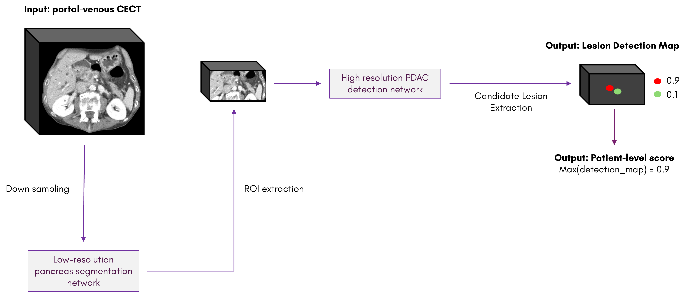

# Baseline Algorithm for the [PANORAMA challenge](https://panorama.grand-challenge.org/): Pancreatic Cancer Diagnosis - Radiologists Meet AI
This repository contains the baseline algorithm for the [PANORAMA challenge](https://panorama.grand-challenge.org/). Model weights were uploaded to Zenodo and can be downloaded using this link:

The algorithm is based on the [nnU-Net framework](https://github.com/MIC-DKFZ/nnUNet) (v2) [1] and consists of a two-step approach for pancreatic ductal adenocarcinoma (PDAC) detection on contrast-enhanced CT scans (CECT). First, a low-resolution nnU-Net model with Dice loss is trained to segment the pancreas. Based on this automatic segmentation, a region of interest (ROI) around the pancreas region is cropped from the original input CECT. The cropped VOIs are used to train a high-resolution nnU-Net algorithm for PDAC detection using cross-entropy loss. This process is summarized in the figure.



<p align="center">Figure 1: Pipeline of the baseline algorithm for the PANORAMA challenge.</p>

## Model training
Training was performed according to the [nnU-Net framework](https://github.com/MIC-DKFZ/nnUNet) (v2) instructions.
Both nnU-Net algorithms were trained using 5-fold cross-validation. The data split per fold can be found here:

### Low-resolution pancreas segmentation model
As a preprocessing step, all images were resampled to (4.5, 4.5, 9.0) spacing, which corresponds to 6x the original median spacing of the training set. This was done using the custom [resample_img](https://github.com/DIAGNijmegen/PANORAMA_baseline/blob/main/src/data_utils.py#L21) function.
After correctly formatting the dataset according to [nnU-Net framework](https://github.com/MIC-DKFZ/nnUNet) (v2) instructions and correctly setting all environment variables, example commands for training are:

```
nnUNetv2_plan_and_preprocess -d Dataset103_PANORAMA_baseline_Pancreas_Segmentation --verify_dataset_integrity
nnUNetv2_train -d Dataset103_PANORAMA_baseline_Pancreas_Segmentation 0 3d_fullres --c
nnUNetv2_train -d Dataset103_PANORAMA_baseline_Pancreas_Segmentation 1 3d_fullres --c
nnUNetv2_train -d Dataset103_PANORAMA_baseline_Pancreas_Segmentation 2 3d_fullres --c
nnUNetv2_train -d Dataset103_PANORAMA_baseline_Pancreas_Segmentation 3 3d_fullres --c
nnUNetv2_train -d Dataset103_PANORAMA_baseline_Pancreas_Segmentation 4 3d_fullres --c
```

### High-resolution PDAC detection model
As a preprocessing steps, all images in the training set were cropped according to the pancreas segmentation (ground truth label = 4), using the custom [CropPancreasROI](https://github.com/DIAGNijmegen/PANORAMA_baseline/blob/main/src/data_utils.py#L53) function. A margin of 100cm x 50cm x 15cm was set according to [previous research](https://pubmed.ncbi.nlm.nih.gov/35053538/) and the anatomical postion of the pancreas [2]. The CE loss was used for training, as this loss is more suitable than Dice for detection tasks [2]. During training network weights were saved every 50 epochs to perform optimal epoch selection. This required a minor alteration to the nnU-Net source code which can be found in [this fork](https://github.com/DIAGNijmegen/nnUNetv2_checkpoints) of the original repository. To install the nnU-Net with this alteration you need to clone the forked repostiory and install the package in editable mode. Furthermore, the [customTrainerCEcheckpoints.py](https://github.com/DIAGNijmegen/PANORAMA_baseline/blob/main/src/customTrainerCEcheckpoints.py) file must be coppied into the nnunetv2/training/nnUNetTrainer/ folder
```
git clone https://github.com/DIAGNijmegen/nnUNetv2_checkpoints.git
cp /path/to/PANORAMA_baseline/src/customTrainerCEcheckpoints.py nnUnet/nnunetv2/training/nnUNetTrainer/customTrainerCEcheckpoints.py
cd nnUNet
pip install -e .
```

After correctly formatting the dataset according to [nnU-Net framework](https://github.com/MIC-DKFZ/nnUNet) (v2) instructions and correctly setting all environment variables, example commands for training are:

```
nnUNetv2_plan_and_preprocess -d Dataset104_PANORAMA_baseline_PDAC_Detection --verify_dataset_integrity
nnUNetv2_train -d Dataset104_PANORAMA_baseline_PDAC_Detection 0 -tr nnUNetTrainer_Loss_CE_checkpoints 3d_fullres --c --npz
nnUNetv2_train -d Dataset104_PANORAMA_baseline_PDAC_Detection 1 -tr nnUNetTrainer_Loss_CE_checkpoints 3d_fullres --c --npz
nnUNetv2_train -d Dataset104_PANORAMA_baseline_PDAC_Detection 2 -tr nnUNetTrainer_Loss_CE_checkpoints 3d_fullres --c --npz
nnUNetv2_train -d Dataset104_PANORAMA_baseline_PDAC_Detection 3 -tr nnUNetTrainer_Loss_CE_checkpoints 3d_fullres --c --npz
nnUNetv2_train -d Dataset104_PANORAMA_baseline_PDAC_Detection 4 -tr nnUNetTrainer_Loss_CE_checkpoints 3d_fullres --c --npz
```


### References:
1. Isensee F, Jaeger PF, Kohl SAA, Petersen J, Maier-Hein KH. nnU-Net: a self-configuring method for deep learning-based biomedical image segmentation. Nat Methods. 2021 Feb;18(2):203-211. doi: 10.1038/s41592-020-01008-z. Epub 2020 Dec 7. PMID: 33288961.
2. Alves N, Schuurmans M, Litjens G, Bosma JS, Hermans J, Huisman H. Fully Automatic Deep Learning Framework for Pancreatic Ductal Adenocarcinoma Detection on Computed Tomography. Cancers (Basel). 2022 Jan 13;14(2):376. doi: 10.3390/cancers14020376. PMID: 35053538; PMCID: PMC8774174.
